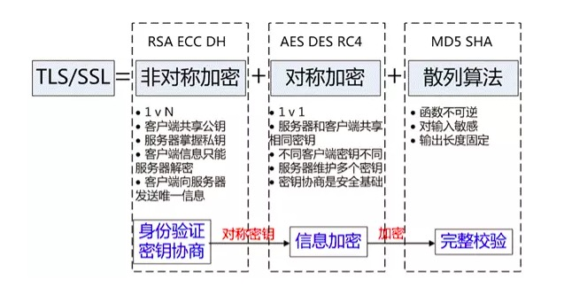

#### 一. 什么是HTTPS

----

HTTPS是在HTTP上建立SSL加密层，并对传输数据进行加密，是HTTP协议的安全版。

#### 二. 为什么需要HTTPS

-----

HTTP协议存在的问题：

+ 通信使用明文（不加密），内容可能被窃取。
+ 无法证明报文的完整性，所以可能被篡改。
+ 不验证通信方的身份，因此有可能遭遇伪装。

HTTPS协议的优势：

+ 数据隐私性：内容经过对称加密，每个连接生成一个唯一的加密密钥。
+ 数据完整性：内容传输经过完整性校验。
+ 身份认证：第三方无法伪造服务端（客户端）身份。

#### 三. HTTPS如何解决HTTP上述问题

-----

所谓HTTPS，其实就是身披SSL协议这层外壳的HTTP。

​		HTTPS协议的主要功能基本都依赖于TLS/SSL协议，TLS/SSL的功能实现主要依赖于三类基本算法：散列韩素，对称加密和非对称加密，其利用非对称加密实现身份认证和密钥协商，对称加密算法采用协商的密钥对数据加密，基本散列函数验证信息的完整性。

1. 解决内容可能被窃听的问题

   + 对称加密

     通信双方使用密钥加密的方式进行通信，缺点是如何保证密钥的安全性。

   + 非对称加密

     ​		使用一对非对称的密钥，一把叫做公开密钥，一把叫做私有密钥。一方使用对方的公钥进行加密后，对方可以用自己的密钥进行解密。

     ​		缺点：公钥并不包含服务器的信息，使用非对称加密算法无法确保服务器身份的合法性，存在中间人攻击的风险，服务器发送给客户端的公钥可能在传说过程中被中间人截获并篡改。另外非对称加密在数据加密解密过程需要消耗一定时间，降低了数据传输效率。

   + 对称加密+非对称加密

     ​		对称加密的效率高，非对称加密的安全性高，利用两者各自的优势，在交换密钥缓解使用非对称加密方式，之后的建立通信报文阶段则使用对称加密方式。

     ​		具体做法是：发送**对称密钥**的一方使用对方的公钥进行加密处理，然后对方用自己的密法解密拿到**对称密钥**，这样可以确保交换的密钥匙安全的前提下，使用对称加密方式进行通信。

2. 解决报文可能篡改问题

   数字签名：能确定消息确实是由发送方签名并发出来的，也能确定消息的完整性，证明数据是否未被篡改过。

   数字签名如何生成：

   

   数字签名校验流程：

​				接收方用发送方的公钥才能解密的摘要信息与用哈希函数对收到的原文产生的摘要信息进行比对，如果		相同，则说明收到的信息是完整的，在传输过程中没有被篡改。

3. 解决通信方身份可能被伪装的问题

   数字证书认证机构的业务流程：

   + 服务器的运营人员向第三方机构CA提交公钥，组织信息，个人信息等信息并申请认证。
   + CA通过线上，线下等多种手段验证申请者提供信息的真实性，如组织是否存在，企业是否合法，是否拥有域名的所有权等。
   + 如信息审核通过，CA会向申请者签发认证文件，即证书。证书包含以下信息：申请者公钥，申请者的组织信息和个人信息，签发机构CA的信息，有效时间，证书序列号等信息的明文，同时包含一个签名。其中签名的产生算法：首先，使用散列函数计算公开的明文信息的信息摘要，然后，采用CA的私钥对信息摘要进行加密，密文即签名。
   + 客户端向服务端发出请求时，服务端访问证书文件。
   + 客户端读取证书中的相关明文信息，采用相同的散列函数计算得到摘要信息，然后利用对应CA的公钥解密签名数据，比对证书的信息摘要，如果一致，则可以确认证书的合法性，即服务器的公开密钥是值得信赖的。
   + 客户端还会验证证书相关的域名信息，有效时间等信息，客户端会内置信任CA的证书信息（包含公钥），如果CA不被信任，则找不到对应CA的证书，证书也会被判定非法。

#### 四. HTTPS的工作流程

----

1. 客户端发起一个HTTPS请求。
2. 服务端把事先配置好的公钥证书返回给客户端。
3. 客户端验证公钥证书：比如是否在有效期内，证书的用途是不是匹配请求的站点，是不是在CRL吊销列表里面，它的上一级证书是否有效，这是一个递归的过程，知道验证到根证书（操作系统内置的Root证书或者Client内置的Root证书）。如果验证通过则继续，不通过则显示警告信息。
4. Client使用伪随机数生成器生成加密所使用的对称密钥，然后用证书的公钥加密这个对称密钥，发给服务端。
5. 服务端使用自己的密钥解密，得到对称密钥。至此，Client和Server都持有相同的对称密钥。就可以使用对称加密的方式进行通信。